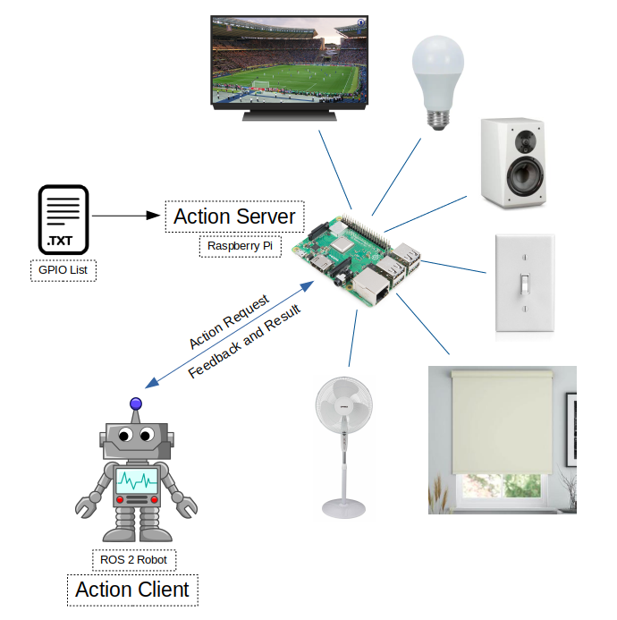

# ROS 2 Raspberry Pi GPIO Control Package
ROS 2 package to control Raspberry Pi GPIO pins

This packages allows you set and read Raspberry Pi GPIO pins via ROS 2 action calls.

Tested with Raspberry Pi3, ROS2 Eloquent, and Ubuntu 18.04 Server



Link to the project video: https://www.linkedin.com/embed/feed/update/urn:li:ugcPost:6654600397346484224

# Demo:

  

# 1. Build Instructions
 ```
 source /opt/ros/<ros2_distro>/setup.bash
 mkdir <your_ros2_ws_name>
 cd your_ros2_ws_name
 mkdir src
 cd src
 git clone https://github.com/mlherd/ros2_pi_gpio.git
 cd ..
 colcon build --sysmlink-install
 source install/setup.bash
 ```
 
# 2. Usage
- ### 2.1 Setup Raspberry Pi
  - Download Ubuntu Server 64-bit 
    - https://ubuntu.com/download/raspberry-pi
  - Flash the image file on your MicroSD card. I use Etcher on Ubuntu and Rufus on Windows. 
    - Etcher: ```[https://www.balena.io/etcher/]```
    - Rufus: ``` [https://rufus.ie/]```
  - Default user name is ubuntu and password is ubuntu.
  - Set up WiFi connection. You can skip this step if you want use the eternet port.
    - sudo nano /etc/netplan/50-cloud-init.yaml
    -  ```
        network:
            ethernets:
                eth0:
                    dhcp4: true
                    optional: true
            version: 2
            wifis:
                wlan0:
                    optional: true
                    dhcp4: true
                    access-points:
                        "<Your WiFi Name>":
                            password: "<Your WiFi Password>"
        ```
        - Save the file and apply the changes
          - ```sudo netplan --debug try```
          - ```sudo netplan --debug generate```
          - ```sudo netplan --debug apply```
    
    - Generate SSH Keys
      - ```sudo ssh-keygen -A```
      
    - Install ROS 2 Eloquent
      - ```https://index.ros.org/doc/ros2/Installation/Eloquent/Linux-Install-Debians/```
      - Make sure you install ROS-Base Install (Bare Bones)
      
    - Install development tools and ROS tools
      - ```https://index.ros.org/doc/ros2/Installation/Eloquent/Linux-Development-Setup/```
      
- ### 2.3 Edit gpio_pins.txt
  - <pin_id>,<input_output>
  - example:
    - 17,out
    - 18,in
- ### 2.4 Run pi_gpio_server
  - You may need to have super user permissions to access GPIO pins
  - ```sudo su```
  - ```ros2 run pi_gpio pi_gpio_server```
- ### 2.5 Send goals to the action server
  - example via command line interface:
    - ros2 action send_goal <action_name> <action_message_type> <action_goal>
  - ```ros2 action send_goal pi_gpio_server pi_gpio_interface/action/GPIO {'gpio: "17,high"'}```
  - ```ros2 action send_goal pi_gpio_server pi_gpio_interface/action/GPIO {'gpio: "18,low"'}```
  - ```ros2 action send_goal pi_gpio_server pi_gpio_interface/action/GPIO {'gpio: "18,read"'}```

# 3. Nodes

- ### 3.1 /pi_gpio_server
  - ROS 2 action server node
  - ### 3.1.1 Actions
    - Action name: pi_gpio
    - Action type: pi_gpio_interface/action/GPIO
    - pi_gpio ([pi_gpio_interface/action/GPIO](https://github.com/mlherd/ros2_pi_gpio/blob/master/pi_gpio_interface/action/GPIO.action))
      - Goal
        - string gpio
      - Result
        - int32 value
      - Feedback
        - int32 feedback

